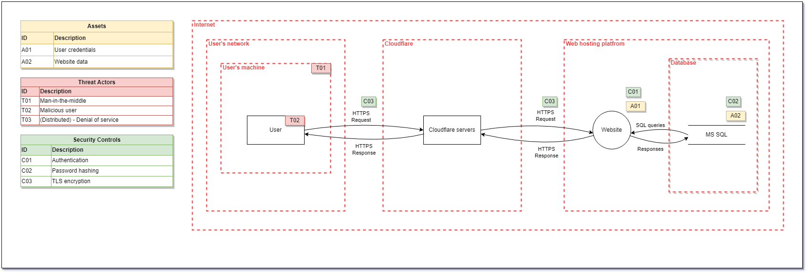

# Goal
Our goal is to create a platform for the school, to let the students and teachers carpool safely. 
It will be a web app where you can post your itinerary and people will be able to join you directly from the web app.
The users will be able to choose the rate per KM.
To protect the platform from external people, the users will have to register with their student cards.
To make a profit we will take a commission on every carpooling session, or maybe have some ads displayed on the website.
Our long-term goal is to make the system available to a wider audience. For example, let the VUB implement our platform for their university.

# Acceptance criteria
The goals we have in mind will be reached as soon as we can establish an encrypted and secure link between the students. The users have to be able to schedule a carpool session within a couple of minutes. To make sure the exchange of information is secure, the users have to sign up using their student ID. The whole process has to be as secure and efficient as possible to ensure a good user experience.

## Requirements for good UX
- The input fields during the registration will be auto-filled with the data retrieved using the student ID.
- The user can reuse an old carpooling session to create a new one with the same itinerary and data.
- The users can use a map to pick a location easily.

## Requirements to start a session - Session life cycle
A carpooling session starts whenever a user - in this case a driver - offers the possibility for other users - in this case a person in need of transport - to join him/her on the ride to campus. A passenger can only join the carpool X-min before the depart time. X is a variable that must be determined by the driver himself, by default this variable will be equal to 1 hour.

### A session goes through different statuses:
- **OPEN:** The session has been created and is available for the users. A user can still update information regarding the session.
- **CLOSED:** The session has begun and is no longer available for outside users.
- **TERMINATED:** The session has successfully been fullfilled.
- **ARCHIVED:** The session is archived in the driver's history for a period of 60 days.
- **DELETED:** The archived session is deleted from the DB after a period of 60 days.

Users can see OPEN - CLOSED sessions, while TERMINATED - ARCHIVED are only visible to the admin and creator/driver of said session.

### A session contains multiple variables, these have to be filled in by the driver of the carpool-session:

- **Title**
- **Depart address**
- **Depart date**
- **Depart time**
- **Amount of available seats:** The amount of available seats the car has excluding the driver's seat.
- **Prefered payment method:** This makes sure the driver and passengers agree to the same payment method.

### In order to start a session a user needs to have a verified account. In order to upgrade an account to a verified one the user needs to fill in additional variables. 

- **Vehicle registration plate**
- **Copy of driver's license**

## Who can see what?
Since this app is only meant to be used by personel and student from the Erasmushogeschool Brussel the data is only available to these people. Using a login system we'll ensure the users trying to access the data are authenticated. A user can only see his/her created or joined sessions. A history tab will be available to see all session they have attended.

## What happens to a user's data when his/her account has been removed ?
Once the user decides to delete his/her account the login information used to login are no longer accepted denying him access to the system. This is done to make sure the user can't perform any CRUD - actions regarding the system while his/her account is disabled, doing this we'll ensure data persistence throughout the system. 
A users data is completely removed once he/she doesn't have any archived or open sessions. All open sessions need to be terminated to delete account succesfully. The users participating to the session will get notified per e-mail to resolve any issues.

# Threat model

## Data Acces and Exposure
- Injection : Use Parameterized SQL commands for all data access.
- Practice Least Privilege - Connect to the database using an account with a minimum set of permissions required to do it's job i.e. not the sa account.
- We will not store Encrypted password. 
- Enforce passwords with a minimum complexity that will survive a dictionary attack i.e. longer passwords that use the full character set (numbers, symbols and letters) to increase the entropy.
- Use a strong encryption routine such as AES-512 where personally identifiable data needs to be restored to it's original format.
- Use TLS 1.2 for the entire site.
- Ensure headers are not disclosing information about your application.

## Broken Access Control
- Reduce the time period a session can be stolen in by reducing session timeout and removing sliding expiration.
- Ensure cookie is sent over HTTPS in the production environment. This should be enforced in the config transforms.
- Protect LogOn, Registration and password reset methods against brute force attacks by throttling requests and considering using ReCaptcha.
- Use authentication or session management privided by .Net .

## Cross site Scripting (XSS)
- Prevention : .NET Frameworks includes the AntiXssEncoder library, which has a comprehensive input encoding library.
- Enable a Content Security Policy, this will prevent your pages from accessing assets it should not be able to access (e.g. a malicious script).
- validateRequest is a value in the web.config that enables limited XSS protection in ASP.NET and should be left intact as it provides partial prevention of Cross Site Scripting.

## Insecure Deserialization
- Validate User Input, Malicious users are able to use objects like cookies to insert malicious information to change user roles.
- We will not accept Serialized Objects from Untrusted Sources and prevent Deserialization of Domain Objects.

## Encryption 
- Use the Windows Data Protection API (DPAPI) for secure local storage of sensitive data.
- In .NET (both Framework and Core) the strongest hashing algorithm for general hashing requirements is System.Security.Cryptography.SHA512.
- In the .NET framework the strongest algorithm for password hashing is PBKDF2, implemented as System.Security Cryptography.Rfc2898DeriveBytes.
- Encrypt sensitive parts of the web.config using aspnet_regiis -pe (command line help).

# Deployment
*minimally, this section contains a public URL of the app. A description of how your software is deployed is a bonus. Do you do this manually, or did you manage to automate? Have you taken into account the security of your deployment process?*
# *you may want further sections*
*especially if the use of your application is not self-evident*
